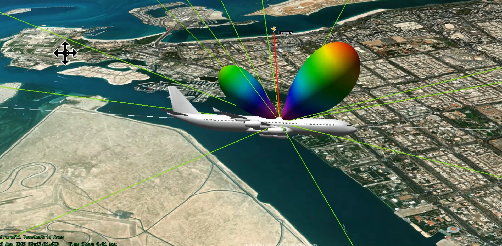
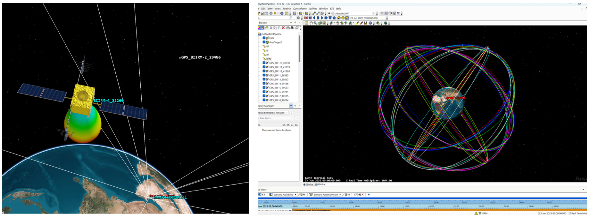
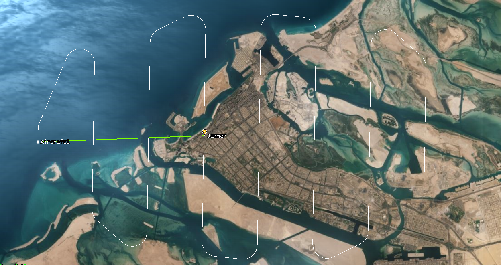
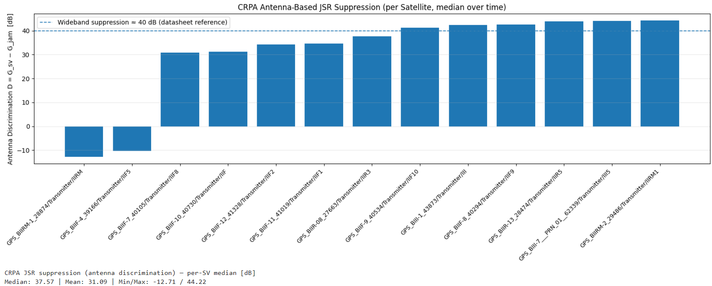

# CRPA-Enabled Airborne GNSS Anti-Jamming

## Introduction

<b>Airborne GNSS robustness study built in STK.</b> A civil airliner flies a low-altitude (10 kft MSL) route over <b>Abu Dhabi</b> while a commercial rooftop jammer on <b>Al Ain Tower</b> radiates at GPS L1. I compare a conventional single-element FRPA against a compact 2-element CRPA (MVDR beamformer) and quantify the effect on received <b>C/N₀</b> and <b>C/(N+I)</b>. The primary stress case uses a <b>20 W</b> jammer with a <b>10 dBi</b> panel mounted on an antenna tracker.

## Table of Contents
* [Overview](#Overview)
* [Scenario Setup](#setup-sec)
* [Flight Profile](#flight-sec)
* [Results](#results-sec)
  * [Median C/N₀ — FRPA, 5 W](#res-frpa-5w)
  * [Median C/N₀ — CRPA, 5 W](#res-crpa-5w)
  * [Median C/N₀ — FRPA, 20 W + 10 dBi panel](#res-frpa-stress)
  * [Median C/N₀ — CRPA, 20 W + 10 dBi panel](#res-crpa-stress)
* [CRPA JSR Suppression](#jsr-sec)
* [Contact / Data Access](#contact-sec)

## Overview and Demo

*Click the image to watch the full demo on YouTube.*

## Scenario Setup

**Constellations**
- GPS IIR / IIR-M / IIF / III satellites imported from [live ephemeris **.txt**](https://celestrak.org/NORAD/elements/gp.php?GROUP=gps-ops&FORMAT=tle) and grouped by block; propagated over the test window.

   
  <em>Resulting orbital planes around Earth and a sample satellite</em>

### Receiver Configuration

| **Parameter** | **Baseline FRPA — [u-blox ANN-MB](https://www.u-blox.com/en/product/ann-mb-series)** | **CRPA (2-Element)** |
|---|---|---|
| Frequency | GPS L1 (1.57542 GHz) | GPS L1 (1.57542 GHz) |
| Element / Geometry | RHCP patch (datasheet typ. **+3.5 dBic** at zenith) | **2 elements**, linear, **0.5 λ** spacing |
| Beamformer | — | **MVDR**, constraint **+3 dB** toward look direction |
| Beam Direction | — | **Automatic** (tracks active GNSS SVs) |
| Null Direction | — | **Jammer** (adaptive null steering) |
| LNA Chain (datasheet) | Total gain **≈ 21.4 dB**; Noise figure **≈ 2.8 dB** | Same noise/gain configuration as FRPA |
| Cable Insertion Loss | RG-174, 5 m **≈ 6.6 dB** | Same as FRPA |

---

### Jammers

| **Parameter** | **Baseline Jammer** | **Stress Jammer** |
|---|---|---|
| Frequency | 1.57542 GHz (GPS L1) | 1.57542 GHz (GPS L1) |
| Location / Height | Abu Dhabi, **Al Ain Tower rooftop**, ≈ **47 stories** | Abu Dhabi, **Al Ain Tower rooftop**, ≈ **47 stories** |
| Transmit Power | **5 W** (**37 dBm = 7 dBW**) | **20 W** (**43 dBm = 13 dBW**) |
| Antenna | Vertical dipole, **~2 dBi** | **Panel 10 dBi** (broadside to route; antenna tracker) |
| **EIRP** | **~9 dBW**  | **~24 dBW** |
| Polarization | **Linear** (≈3 dB mismatch vs RHCP GNSS) | **Linear** |
| Spectrum | **Gaussian noise**, **5 MHz** centered at L1 | **Gaussian noise**, **5 MHz** centered at L1 |
| Pointing | Omni (dipole) | Tracks the aircraft |

#### GPS Space Transmitters (by Block)

| Parameter                          | **IIR**                 | **IIR-M**               | **IIF**                | **III**               |
|------------------------------------|-------------------------|-------------------------|------------------------|-----------------------|
| Signal / Frequency                 | L1 C/A @ **1575.42 MHz** | L1 C/A @ **1575.42 MHz** | L1 C/A @ **1575.42 MHz** | L1 C/A @ **1575.42 MHz** |
| Satellite Antenna Gain (boresight) | **11.7 dBic**           | **12.25 dBic**          | **13.0 dBic**          | **13.0 dBic**         |
| Transmitter Power                  | **14.3 dBW**            | **14.75 dBW**           | **15.0 dBW**           | **17.0 dBW**          |
| Resulting EIRP (boresight)         | **26 dBW**              | **27 dBW**              | **28 dBW**             | **30 dBW**            |
| Polarization                       | RHCP                    | RHCP                    | RHCP                   | RHCP                  |

## Flight Profile
- Platform: Commercial Airliner.
- Altitude: **10 kft MSL** (terminal/loiter representative).
- Track: Searches an **AreaTarget** to sweep jammer bearings/elevations.
- **Environment:** ITU-R propagation models at L1 (1.575 GHz)  
  - [P.618](https://www.itu.int/rec/R-REC-P.618/en) — Earth–space path prediction (rain, scintillation, clouds/gases aggregation)  
  - [P.840](https://www.itu.int/rec/R-REC-P.840/en) — Cloud & fog attenuation  
  - [P.676](https://www.itu.int/rec/R-REC-P.676/en) — Atmospheric gases (O₂, H₂O) attenuation  

   
  <em>Track</em>

   
  <em>AER</em>

   
  <em>Satellites access to the aircraft</em>

---

## Results

The plots below show per-satellite **median** C/(N+I), C/N, and the **median loss** (ΔC/N₀ = C/N − C/(N+I)), with the dashed line marking the ~**35 dB-Hz** “robust GPS L1 C/A operation”[Wieser, 2006: conventional receivers acquire/track above ~33–35 dB-Hz](https://w.fig.net/resources/proceedings/2006/baden_2006_comm6/PDF/GPS2/Wieser.pdf).

### Commercial Rooftop Jammer (Baseline Case)

**FRPA (single-element)**

  

**CRPA (2-element MVDR)**

  

---

### Directional Jammer — Stress Test (20 W, 10 dBi panel)

**FRPA (single-element)**

  

**CRPA (2-element MVDR)**

  

**Reading the plots**
- **Blue**: Median C/(N+I) with interference present  
- **Orange**: Median C/N with no interference  
- **Green**: Median **ΔC/N₀** (jam-imposed degradation)  
- **Dashed line**: ~35 dB-Hz comfort threshold for robust L1 C/A operation

#### Numeric Summary

| Jammer scenario                             | Receiver             | Median ΔC/N₀ (dB-Hz) | Min / Max ΔC/N₀ (dB-Hz) | Headline                                                                       |
| ------------------------------------------- | -------------------- | -------------------: | ----------------------: | ------------------------------------------------------------------------------ |
| **Commercial rooftop (omni, L1)**           | **FRPA**             |             **8.21** |             6.48 / 8.37 | Clear ~8 dB-Hz median hit per SV. Several SVs ride near the 35 dB-Hz line.    |
| **Commercial rooftop (omni, L1)**           | **2-el CRPA (MVDR)** |             **0.38** |             0.03 / 0.58 | Jam impact nearly washed out; medians essentially unchanged.                   |
| **Directional stress (20 W, 10 dBi panel)** | **FRPA**             |            **23.89** |           21.89 / 25.17 | Heavy degradation (~24 dB-Hz). ALL SVs medians near/below robust threshold.   |
| **Directional stress (20 W, 10 dBi panel)** | **2-el CRPA (MVDR)** |             **4.09** |             0.72 / 5.24 | Strong mitigation; kept every SV that was above 35 dB-Hz above the same threshold. |

*Takeaway:* CRPA consistently reduces median loss versus FRPA in both the commercial and stress scenarios, keeping more satellites above the ~35 dB-Hz line even under directional high-power jamming.  
*Note:* In several epochs the CRPA places a deep **null toward the jammer**, which coincides with the directions of **IIF5** and **IIRM** satellites at times—hence their dips.

---

## CRPA JSR Suppression 

   
  <em>Antenna discrimination <code>D = G_sv − G_jam</code> (dB) per satellite, median over time. Dashed line: nominal <strong>&gt;40 dB</strong> wideband suppression from vendor datasheet.</em>

- **What this is:** `D` is the beamformer’s **JSR suppression** (null depth) between the CRPA look to a tracked satellite and the jammer DOA, computed from STK **Rcvr Gain (dB)** time histories.  
- **How to read it:** `JSR_out ≈ JSR_in − D`. Bars near or above ~**40 dB** indicate datasheet-class performance. Small negative bars reflect short **null crossings** of a satellite DOA during maneuvers.  
- **Benchmark:** [TUALCOM ANTY datasheet (>40 dB)](https://www.tualcom.com/wp-content/uploads/2023/09/tualcom-anty.pdf)

## Contact / Data Access

Simulation files are **available upon request**.  
Email: **rawashdeh758@gmail.com**.

