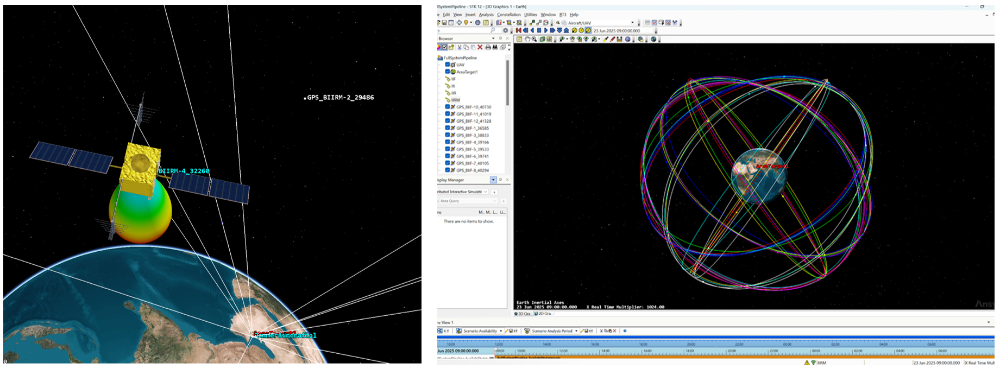

# CRPA-Enabled Airborne GNSS Anti-Jamming

## Introduction

<b>Airborne GNSS robustness study built in STK.</b> A civil airliner flies a low-altitude (10 kft MSL) route over <b>Abu Dhabi</b> while a commercial rooftop jammer on <b>Al Ain Tower</b> radiates at GPS L1. I compare a conventional single-element FRPA against a compact 2-element CRPA (MVDR beamformer) and quantify the effect on received <b>C/N₀</b> and <b>C/(N+I)</b>. The primary stress case uses a <b>20 W</b> jammer with a <b>10 dBi</b> panel.

## Table&nbsp;of&nbsp;Contents
* [Overview](#Overview)
* [Scenario Setup](#setup-sec)
* [Receiver Models](#rx-sec)
* [Jammer Models](#jam-sec)
* [Flight Profile](#flight-sec)
* [Data Products & Method](#method-sec)
* [Results](#results-sec)
  * [Navigation Accuracy (visual check)](#navacc-sec)
  * [Median C/N₀ — FRPA, 5 W](#res-frpa-5w)
  * [Median C/N₀ — CRPA, 5 W](#res-crpa-5w)
  * [Median C/N₀ — FRPA, 20 W + 10 dBi panel](#res-frpa-stress)
  * [Median C/N₀ — CRPA, 20 W + 10 dBi panel](#res-crpa-stress)
* [How to Reproduce](#repro-sec)
* [Repo Layout](#layout-sec)
* [Notes & Assumptions](#notes-sec)

## Overview

  <video src="Media/Overview.mp4" width="95%" controls loop muted playsinline>
    Your browser does not support the video tag. 
    You can <a href="Media/overview.mp4">download the MP4 here</a>.
  </video> 
  <em>The Scene.</em>

## Scenario Setup

**Constellations**
- GPS IIR / IIR-M / IIF / III satellites imported from [live ephemeris **.txt**](https://celestrak.org/NORAD/elements/gp.php?GROUP=gps-ops&FORMAT=tle) and grouped by block; propagated over the test window.

   
  <em>Resulting orbital planes around Earth and a sample satellite</em>

## Receiver Models

**FRPA (baseline) — u-blox ANN-MB active patch (L1)**
- Element: RHCP patch, typ. **+3.5 dBic** zenith gain.
- Integrated LNA chain: total gain ~**21.4 dB**, NF ~**2.8 dB**.
- Cable insertion loss (RG-174, 5 m) ≈ **6.6 dB**.
- System noise temps set to **290 K**; rain model enabled for 0.1% outage.
- Implemented in STK “Complex Receiver Model” to mimic the datasheet chain.

   
  <em>Receiver noise / gain chain implemented to mimic u-blox ANN-MB</em>

   
  <em>Excerpted ANN-MB element & amplifier specifications</em>

**CRPA**
- Phased array, **2 elements**, linear, **0.5 λ** spacing @ 1.57542 GHz; back-lobe suppression 20 dB; element factor enabled.
- **Beamformer:** MVDR with **+3 dB** constraint in the look direction.
- **Null Direction Provider:** *Object → Jammer* (automatic adaptive null).
- **Beam Direction Provider:** *Automatic* (main lobe tracks active GNSS SVs).

   
  <em>Aircraft with adaptive CRPA pattern (illustrative)</em>

## Jammer Models

**Baseline — Al Ain Tower rooftop (urban)**
- Frequency: GPS L1 (1.57542 GHz) wideband noise.
- Power: **5 W** (37 dBm); antenna: vertical dipole (~**+2 dBi**).  
  EIRP ≈ **39 dBm**.

**Stress case**
- Power: **20 W** (**43 dBm**) with a **10 dBi panel** aimed along the route.  
  EIRP ≈ **53 dBm**.

> First-order sanity for J/S:
>
> \[
> J\!/\!S\_\text{dB} \approx \text{EIRP}\_{J} - L\_{FS}(d) + G\_{Rx}(\theta,\phi) - P\_{Sig,Rx}
> \]
> The simulation uses full geometry, time-varying gains, and platform motion.

## Flight Profile
- Platform: “Basic Airliner.”
- Altitude: **10 kft MSL** (terminal/loiter representative).
- Track: arcs over an **AreaTarget** to sweep jammer bearings/elevations.

   
  <em>Loitering track across the Abu Dhabi AreaTarget</em>

   
  <em>Access timeline to GPS blocks and to the Jammer</em>

## Data Products & Method
- **Navigation Accuracy FOM** rendered once to visually confirm realism.
- **C/N₀ vs. time** per SV exported; **median** per-SV used for headline plots.  
  (Minima are tracked during design but dominated by short, intentional CRPA nulls.)
- **Receiver Gain vs. time** used to validate null/steer dynamics.

   
  <em>Receiver gain dynamics — short, deep nulls when the adaptive null crosses a satellite DOA</em>

---

## Results

### Navigation Accuracy (visual check)

   
  <em>Navigation accuracy FOM over the route (no jammer overlays)</em>

### Median C/N₀ — FRPA, 5 W jammer

   
  <em>Single-element u-blox ANN-MB under 5 W rooftop interference</em>

**Observation:** Median C/N₀ dips into the **low-30s dB-Hz** for several SVs when geometry tightens range to the tower; still generally trackable but with reduced margin.

### Median C/N₀ — CRPA, 5 W jammer

   
  <em>2-element MVDR CRPA with adaptive null on the jammer</em>

**Observation:** Median C/N₀ **recovers vs. FRPA**; adaptive null removes most jammer power while the main lobe tracks SVs.

### Median C/N₀ — FRPA, 20 W + 10 dBi panel (stress)

   
  <em>Stress: 20 W + 10 dBi panel, FRPA receiver</em>

**Observation:** FRPA shows **severe** degradation near panel boresight; margins frequently insufficient.

### Median C/N₀ — CRPA, 20 W + 10 dBi panel (stress)

   
  <em>Stress: 20 W + 10 dBi panel, MVDR CRPA</em>

**Observation:** CRPA preserves **meaningfully higher** median C/N₀ than FRPA under identical stress, demonstrating practical anti-jamming value for airborne platforms over Abu Dhabi.

---

## How to Reproduce
1. Import live GPS ephemeris **.txt**, sort by SVN/block, propagate.
2. **Receivers**  
   • FRPA: configure noise/gain per u-blox ANN-MB specs.  
   • CRPA: 2-el, 0.5 λ, MVDR (+3 dB), Null→Jammer, Beam→Automatic.
3. **Jammers**  
   • Baseline: **5 W** dipole on Al Ain Tower.  
   • Stress: **20 W + 10 dBi** panel aimed at the route.
4. Fly the **10 kft** loiter track over the AreaTarget.
5. Export C/N₀ time series; compute **median** per SV; render the plots.

## Repo Layout
