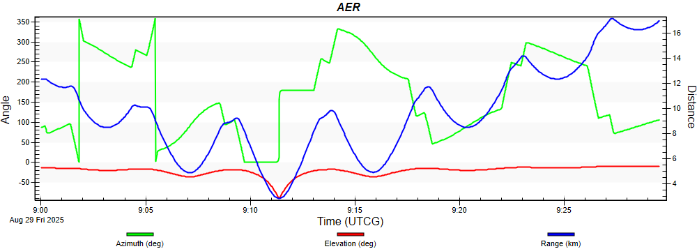
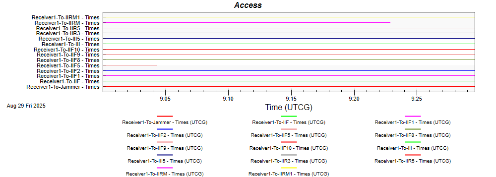
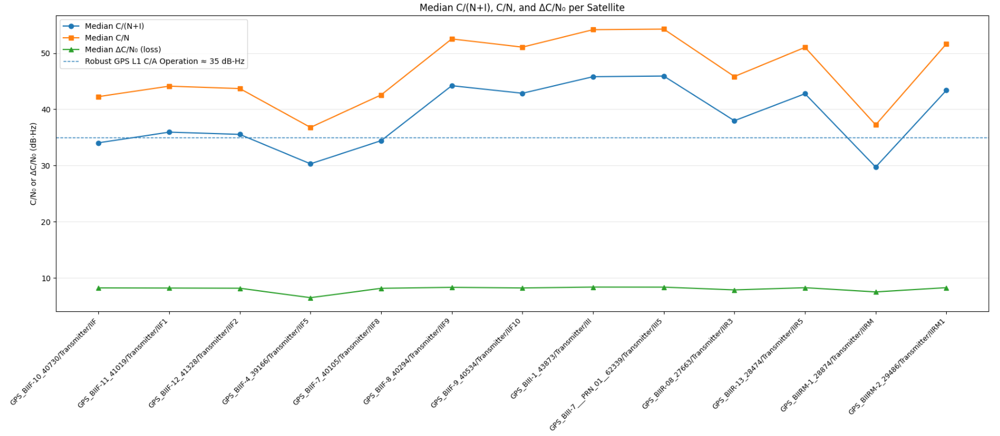
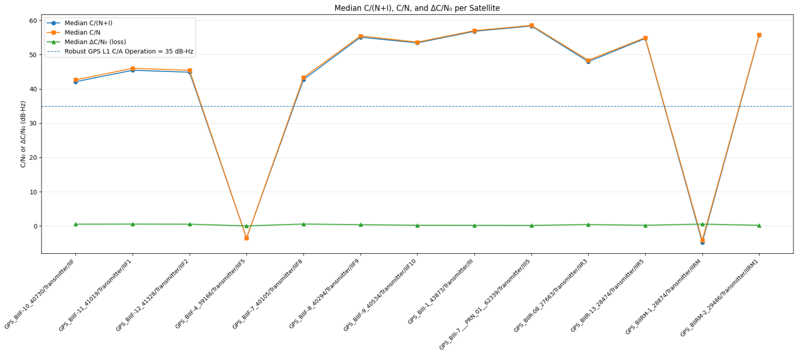
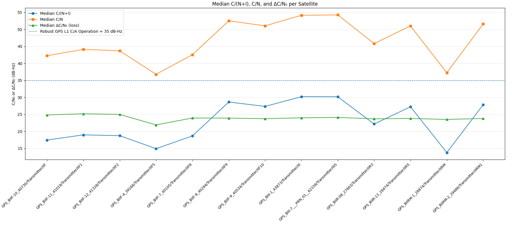
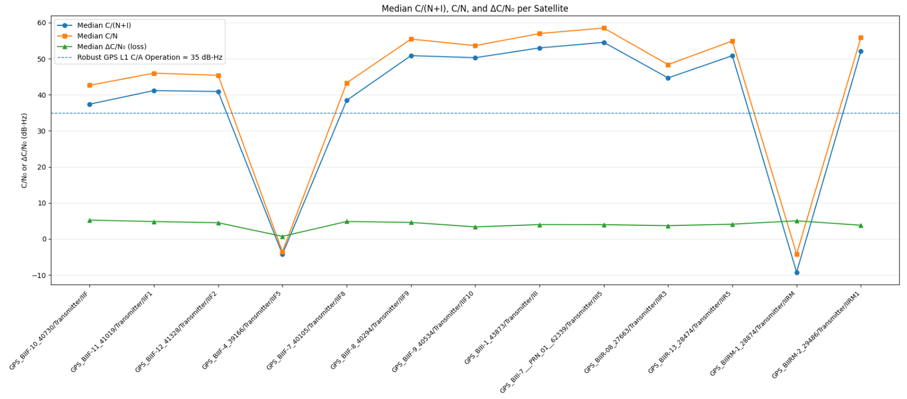

# CRPA-Enabled Airborne GNSS Anti-Jamming

## Introduction

<b>Airborne GNSS robustness study built in STK.</b> A civil airliner flies a low-altitude (10 kft MSL) route over <b>Abu Dhabi</b> while a commercial rooftop jammer on <b>Al Ain Tower</b> radiates at GPS L1. I compare a conventional single-element FRPA against a compact 2-element CRPA (MVDR beamformer) and quantify the effect on received <b>C/N₀</b> and <b>C/(N+I)</b>. The primary stress case uses a <b>20 W</b> jammer with a <b>10 dBi</b> panel.

## Table&nbsp;of&nbsp;Contents
* [Overview](#Overview)
* [Scenario Setup](#setup-sec)
* [Flight Profile](#flight-sec)
* [Data Products & Method](#method-sec)
* [Results](#results-sec)
  * [Navigation Accuracy (visual check)](#navacc-sec)
  * [Median C/N₀ — FRPA, 5 W](#res-frpa-5w)
  * [Median C/N₀ — CRPA, 5 W](#res-crpa-5w)
  * [Median C/N₀ — FRPA, 20 W + 10 dBi panel](#res-frpa-stress)
  * [Median C/N₀ — CRPA, 20 W + 10 dBi panel](#res-crpa-stress)
* [How to Reproduce](#repro-sec)
* [Repo Layout](#layout-sec)
* [Notes & Assumptions](#notes-sec)

## Overview

  <video src="Media/Overview.mp4" width="95%" controls loop muted playsinline>
    Your browser does not support the video tag. 
    You can <a href="Media/overview.mp4">download the MP4 here</a>.
  </video> 
  <em>The Scene.</em>

## Scenario Setup

**Constellations**
- GPS IIR / IIR-M / IIF / III satellites imported from [live ephemeris **.txt**](https://celestrak.org/NORAD/elements/gp.php?GROUP=gps-ops&FORMAT=tle) and grouped by block; propagated over the test window.

   
  <em>Resulting orbital planes around Earth and a sample satellite</em>

### Receiver Configurations

#### Baseline FRPA — [u-blox ANN-MB](https://www.u-blox.com/en/product/ann-mb-series)

| Parameter             | Value / Setting                                                                 |
|-----------------------|----------------------------------------------------------------------------------|
| Frequency             | GPS L1 (1.57542 GHz)                                                             |
| Element               | RHCP patch (datasheet typ. **+3.5 dBic** at zenith)                             |
| LNA Chain (datasheet) | Total gain **≈ 21.4 dB**; Noise figure **≈ 2.8 dB**                             |
| Cable Insertion Loss  | RG-174, 5 m **≈ 6.6 dB**                                                         |

#### CRPA (2-Element)

| Parameter              | Value / Setting                                                                 |
|------------------------|----------------------------------------------------------------------------------|
| Frequency              | GPS L1 (1.57542 GHz)                                                             |
| Geometry               | **2 elements**, linear, **0.5 λ** spacing                                        |
| Element Factor         | Enabled; back-lobe suppression **20 dB**                                         |
| Beamformer             | **MVDR**, constraint **+3 dB** toward look direction                             |
| Beam Direction| **Automatic** (main lobe tracks active GNSS SVs)                                |
| Null Direction | **Jammer** (adaptive null steering)                                     |
| Receiver Chain         | Same noise/gain configuration as FRPA                   |

#### Baseline Jammer — Al Ain Tower Rooftop

| Parameter              | Value / Setting                                                  |
|------------------------|------------------------------------------------------------------|
| Frequency              | 1.57542 GHz (GPS L1)                                            |
| Location / Height      | Abu Dhabi, **Al Ain Tower rooftop**, ≈ **47 stories** (~180–200 m AGL) |
| Transmit Power         | **5 W** (**37 dBm = 7 dBW**)                                    |
| Antenna                | Vertical dipole, **~2 dBi**                                     |
| Feed / Cable Loss      | **~0.5 dB**                                                     |
| **EIRP**               | **~8.5 dBW** (7 dBW + 2 dBi − 0.5 dB)                           |
| Polarization           | **Linear** (≈3 dB mismatch vs RHCP GNSS)                        |
| Spectrum               | **Gaussian noise**, **5 MHz** centered at L1                    |
| Pointing               | Omni (dipole)                                                   |

---

#### Stress Jammer — 20 W + 10 dBi Panel

| Parameter              | Value / Setting                                                  |
|------------------------|------------------------------------------------------------------|
| Frequency              | 1.57542 GHz (GPS L1)                                            |
| Location / Height      | Abu Dhabi, **Al Ain Tower rooftop**, ≈ **47 stories**           |
| Transmit Power         | **20 W** (**43 dBm = 13 dBW**)                                  |
| Antenna                | **Panel 10 dBi** (fixed broadside toward route)                 |
| Feed / Cable Loss      | **~1.0 dB**                                                     |
| **EIRP**               | **~23 dBW** (13 dBW + 10 dBi − 1 dB)                            |
| Polarization           | **Linear** (RHCP optional for worst-case)                       |
| Spectrum               | **Gaussian noise**, **5 MHz** centered at L1                    |
| Pointing               | tracks the aircraft                   |

---

#### GPS Space Transmitters (by Block)

| Parameter                          | **IIR**                 | **IIR-M**               | **IIF**                | **III**               |
|------------------------------------|-------------------------|-------------------------|------------------------|-----------------------|
| Signal / Frequency                 | L1 C/A @ **1575.42 MHz** | L1 C/A @ **1575.42 MHz** | L1 C/A @ **1575.42 MHz** | L1 C/A @ **1575.42 MHz** |
| Satellite Antenna Gain (boresight) | **11.7 dBic**           | **12.25 dBic**          | **13.0 dBic**          | **13.0 dBic**         |
| Transmitter Power | **14.3 dBW**            | **14.75 dBW**           | **15.0 dBW**           | **17.0 dBW**          |
| Resulting EIRP (boresight)     | **26 dBW**              | **27 dBW**              | **28 dBW**             | **30 dBW**            |
| Polarization                       | RHCP                    | RHCP                    | RHCP                   | RHCP                  |

## Flight Profile
- Platform: “Basic Airliner.”
- Altitude: **10 kft MSL** (terminal/loiter representative).
- Track: Searches an **AreaTarget** to sweep jammer bearings/elevations.

   
  <em>AER</em>

   
  <em>Satellites access to the aircraft</em>

## Data Products & Method
- **Navigation Accuracy FOM** rendered once to visually confirm realism.
- **C/N₀ vs. time** per SV exported; **median** per-SV used for headline plots.  
  (Minima are tracked during design but dominated by short, intentional CRPA nulls.)
- **Receiver Gain vs. time** used to validate null/steer dynamics.

   
  <em>Receiver gain dynamics — short, deep nulls when the adaptive null crosses a satellite DOA</em>

---

## Results

The plots below show per-satellite **median** C/(N+I), C/N, and the **median loss** (ΔC/N₀ = C/N − C/(N+I)) with the 35 dB-Hz “robust GPS L1 C/A operation” reference shown as a dashed line.

### Commercial Rooftop Jammer (Baseline Case)

| FRPA (single-element) | CRPA (2-element MVDR) |
|---|---|
|  |  |

### Directional Jammer — Stress Test (20 W, 10 dBi panel)

| FRPA (single-element) | CRPA (2-element MVDR) |
|---|---|
|  |  |

**Reading the plots**
- **Blue**: Median C/(N+I) with interference present.  
- **Orange**: Median C/N with no interference.  
- **Green**: Median **ΔC/N₀** (jam-imposed degradation).  
- **Dashed line**: ~35 dB-Hz comfort threshold for robust L1 C/A operation.

*Takeaway:* CRPA consistently reduces median loss versus FRPA in both the commercial and stress scenarios, keeping more satellites above the ~35 dB-Hz line even under directional jamming.

## How to Reproduce
1. Import live GPS ephemeris **.txt**, sort by SVN/block, propagate.
2. **Receivers**  
   • FRPA: configure noise/gain per u-blox ANN-MB specs.  
   • CRPA: 2-el, 0.5 λ, MVDR (+3 dB), Null→Jammer, Beam→Automatic.
3. **Jammers**  
   • Baseline: **5 W** dipole on Al Ain Tower.  
   • Stress: **20 W + 10 dBi** panel aimed at the route.
4. Fly the **10 kft** loiter track over the AreaTarget.
5. Export C/N₀ time series; compute **median** per SV; render the plots.

## Repo Layout
